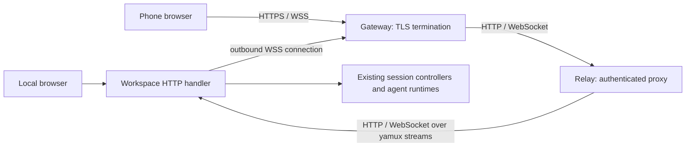

# Remote control

Remote control exposes the existing workspace server through an outbound
connection. A phone uses the same HTTP APIs and WebSocket session protocol as
a local browser. Agent execution, transcripts, queues, prompts, and command
receipts remain in the workspace server.

## Effect for users

| Situation | Result |
| --- | --- |
| Open a workspace from a phone | Scan the printed link; the workspace needs only an outbound connection. |
| Lose the remote connection during a response | The agent keeps running. Reconnecting recovers the current transcript using the existing session snapshot protocol. |
| Retry a send whose receipt was lost | The same request ID returns its receipt instead of starting another execution within that server lifetime. |
| Switch agents on a phone | The selector stays in the header and uses the platform picker, so it cannot hide behind the session dialog. |
| Rotate or resize the browser | The existing composer stays mounted and retains its draft. |
| Operate the relay | Configure a token and port; the existing gateway manages HTTPS and certificates. |

Session recovery and retry guarantees come from the existing protocol. This
feature makes them available over the remote connection.

## Architecture



`pkg/remote` carries ordinary HTTP connections over independent yamux streams
inside one WebSocket. The relay uses Go's reverse proxy, including WebSocket
upgrades. It does not interpret session commands or invent a second event
protocol. A blocked response can stay open while other requests proceed.

| Owner | State |
| --- | --- |
| Workspace server | Backend runtimes, session views, revisions, queues, prompts, command receipts. |
| Browser | Navigation, drafts, and the existing workspace client's cached session views. |
| Relay | Current tunnel connections and pairing credentials. No agent or chat session state. |
| Gateway | Public HTTPS endpoint and certificate management. |

The integration in `server/remote.go` starts the transport after constructing
the HTTP handler and attaches it to the workspace context and background wait
group. Closing the workspace cancels the transport and joins it. Losing only
the tunnel cancels its HTTP requests but leaves agent execution running.

The client reconnects with backoff from 1 to 30 seconds. A successful
connection resets the backoff. Authentication/configuration rejections stop
retrying. The relay acknowledges registration after publishing the tunnel;
the workspace prints the pairing link only after that acknowledgement.

## What changed from the reference branch

`feature/rc` supplied the useful idea: an outbound WebSocket carrying HTTP
connections, with QR pairing. The implementation here was rebuilt against the
current session/workspace architecture rather than merging its older UI and
state handling.

- The relay has one listen parameter: an integer port. It binds `:port` and
  serves HTTP. There are no address, TLS, ACME, certificate, or cache options.
- Remote configuration is explicit CLI/environment input. There is no second
  persisted configuration path or token exposed through the settings API.
- Workspace lifetime controls the tunnel. Shutdown cancels active requests;
  failed startup and listener errors clean up their background work.
- A reconnect can replace only a tunnel with the same key. Old connection
  cleanup cannot remove a replacement, and blocking connection teardown runs
  outside the relay's registration lock.
- Pairing secrets live in URL fragments, outside HTTP request paths. Pairing
  changes the browser cookie through a same-origin POST.
- Phone navigation surrounds the existing mounted workspace. It does not
  create another chat tree or another session store. The agent picker is a
  native select in the header, outside the session dialog.

## Deployment

Start a relay on the gateway's private network:

```bash
WINGMAN_RELAY_TOKEN="your-secret" wingman relay --port 8080
```

Start a workspace with that relay's public origin and the same token:

```bash
WINGMAN_REMOTE_TOKEN="your-secret" wingman server --remote https://relay.example.com
```

The default relay port is 8080; accepted ports are 1–65535. `--token` overrides
`WINGMAN_RELAY_TOKEN`. The workspace also accepts `WINGMAN_REMOTE_URL` and
`--remote-token`. Explicit flags override environment values. Configuration
is not written to `config.json`.

The gateway must route the whole origin to the relay, preserve the original
`Host`, set `X-Forwarded-Proto: https`, allow WebSocket upgrades, and avoid
buffering streaming responses. Configure its connection timeouts for long
lived WebSockets. TLS terminates at the gateway; the relay listens only on
HTTP. The workspace connects to the public HTTPS/WSS origin. Plain HTTP/WS
URLs are accepted only for loopback development.

Build a relay image from this checkout:

```bash
docker build -f docker/relay/Dockerfile -t wingman-relay .
docker run --rm --network your-gateway-network \
  -e WINGMAN_RELAY_TOKEN wingman-relay --port 8080
```

Set `WINGMAN_RELAY_TOKEN` in the host environment before running that command.
The image contains a static binary, runs as UID 65532, and needs no volumes or
certificate storage. Connect the gateway to container port 8080.

## Pairing and lifetime

Each workspace server run generates a random tunnel ID and key. The shared
registration token authorizes workspace connections to the relay; a pairing
link authorizes browser access to one workspace.

The link has the form `/pair#id.key`. The pairing page removes the fragment
from browser history, then sends credentials in a POST body. The relay sets
an HttpOnly, SameSite=Lax cookie, with Secure enabled behind the HTTPS
gateway. The proxy removes that cookie before forwarding workspace requests.
Neither the workspace settings nor API request paths contain the pairing key.

The pairing link is reusable while that workspace server is alive. Reconnects
keep the credentials, so existing browsers recover without scanning again.
A workspace restart creates new credentials and requires pairing again.
`POST /unpair` clears this browser's cookie; clearing site data does the same.

One browser cookie selects one workspace per relay origin. Pairing another
workspace changes that selection for all tabs on the origin. The existing
instance ID checks reject stale commands from older pages. An already-open
WebSocket remains attached to its original workspace until it closes.

The gateway and relay are trusted components: they can see proxied traffic
and pairing credentials. This is not end-to-end encryption. Anyone holding
the pairing link has the local web UI's capabilities, including file and
terminal access. Use a relay origin you control, and keep registration tokens
and pairing links private.

## Phone behavior

On touch devices up to 1024 CSS pixels wide, the UI shows a header with an
agent selector, sessions button, and new-session button. Sessions use the
existing dialog and list, with explicit deletion buttons and error/retry
feedback. The agent picker uses the platform's native selection UI.

The chat remains mounted through viewport changes, preserving unsent input.
Side panels are hidden, a split workspace displays its active pane, and a
Back to chat action returns from an opened file or other view. Dynamic
viewport height, safe-area padding, a 16-pixel composer font, and larger touch
targets improve phone use without changing the desktop navigation model.

## Verification and limits

Transport tests cover HTTP and WebSocket forwarding, rejected credentials,
cross-origin pairing/unpairing, HTTPS gateway cookie attributes, cancellation,
automatic reconnect, competing registrations, replacement cleanup, listener
failure, and twenty concurrent 512-KiB uploads while a streaming response is
blocked. Response bodies are checked byte for byte.

Server integration tests run the real session API through the relay. They
verify that retries reuse receipts, a running transcript survives tunnel
restart, closing one workspace leaves another connected, and pairing another
workspace cannot redirect a stale command into it.

Browser tests cover phone layout and agent switching, popup visibility and
hit testing, composer identity across resizing, QR-link pairing, live session
sharing with a local browser, reload recovery, and a lost command receipt
through the relay without a second model invocation.

Verified on 7 September 2026:

- `go test ./...` passed.
- `go test -race ./pkg/remote ./server ./cmd/wingman` passed. The focused
  transport and remote session regressions also passed ten runs with the race
  detector.
- `npm run test:unit` in `server/ui` passed all 73 tests; the production UI
  build passed. Focused lint checks passed for the new mobile modules and
  modified session list. The build retains its existing large-chunk warning.
- `go test -tags=e2e ./server -run TestWebUIE2E -count=1 -v` passed all 65
  browser tests, including the five added phone/remote tests.
- A static Linux/amd64 build and the relay Docker build passed. The container
  served HTTP on port 8080 as a non-root user with a read-only filesystem,
  rejected invalid ports and missing registration configuration, served the
  pairing page, rejected cross-origin pairing, and exited with code 0 on
  SIGTERM. The test container was removed afterward.

The relay stores connections in memory and expects one running relay instance
per origin. It is not a distributed relay service. Command receipts retain the
existing guarantee for one workspace server lifetime; this feature adds no
execution guarantee across a process restart. See
[session-state-protocol.md](session-state-protocol.md).

Browser coverage uses Chromium with mobile/touch emulation. A deployed gateway,
a physical phone, and Safari's keyboard/picker behavior still need deployment
verification.
