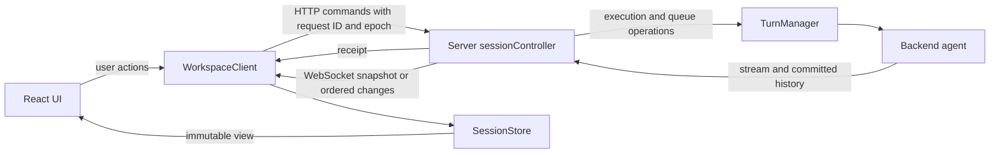

# Session/workspace architecture: follow-up review

Reviewed and tested on 7 September 2026. This review covers execution ownership, persistence, browser synchronization, request retries, backend startup, deletion, shutdown, and tab state. The protocol and remaining implementation limits are described in [session-state-protocol.md](session-state-protocol.md).

The server owns the transcript, queue projection, prompts, and session settings. The browser owns drafts and navigation. The second review fixed lifecycle and ordering bugs within that ownership model.

## What users get

| Situation | Previous failure or limitation | Current behavior |
| --- | --- | --- |
| Two windows use different agents | Browser selection could replace shared execution ownership. | Each backend has its own runtime; choosing a backend is local navigation. |
| A browser reloads or reconnects during a response | Live text depended on browser-side reconstruction and history matching. | A server snapshot includes the unfinished response; another browser sees the same transcript and pending prompts. |
| The server accepts a message but its HTTP response is lost | Delivery uncertainty could lead to another execution on retry. | The retained request ID returns the original result within the same server lifetime. Concurrent identical sends also share one HTTP request. |
| A queue file temporarily cannot be read or written | Some queue actions could overwrite unread work; an error could leave the manager unable to accept new work after recovery. | Failed mutations preserve the queue, reads can retry, recovered work stays paused, and successful writes clear the queue error. |
| A slow backend starts or one session reads its queue | A shared lock could stall unrelated backends or sessions. | Slow initialization and queue reads hold only the relevant startup/session ownership. Existing work can continue. |
| A session is deleted while its response finishes | Final queue writes could happen after backend deletion and recreate storage. | Deletion waits for turn finalization before deleting history. |
| A workspace closes while a backend is loading or serving a read | Resources could close while still in use, or a read could keep shutdown waiting without receiving cancellation. | Shutdown cancels admitted work, joins it, and then closes the backend. Late startup results are disposed. |
| The last session tab closes | The replacement draft could silently select Wingman. | The new draft keeps the closed session's backend. |
| Bootstrap briefly returns an error after disconnect | The client could interpret failure as workspace replacement, or use a stale response after restarting. | Temporary errors retry; only a current successful bootstrap identifying a different instance triggers the reload banner. |

Switching the workspace still requires reload to connect to its new instance. Existing editor buffers and unsent drafts remain available until the user chooses to reload.

## Communication and ownership

HTTP receipts acknowledge a command. They do not replace browser session state. The subscription supplies the complete view and subsequent revisions. If an update is missing, the browser requests a snapshot instead of guessing how to merge history.

The second review removed several sources of duplicate ownership:

- Normal commands and prompt answers now use one request-ID ledger. IDs are reserved before execution waits, so a pending settings command cannot share its ID with the prompt that it produced. Prompt answers can still proceed while that command is waiting.
- Each workspace client owns its scoped HTTP transport. Commands from one client cannot pick up another client's instance header. This also removes the HTTP/client circular import.
- A single map holds each draft creation's ID and pending result. Its key includes the backend.
- The layout reducer alone creates fallback drafts. Identity generation happens when dispatching, making repeated reducer evaluation deterministic.
- Session metadata cannot overwrite protocol fields. The event envelope owns identity and revision; transcript changes own entries.

## Hard tests added

The new regressions reproduce failures before the corresponding fixes. Other tests explicitly protect ordering invariants that already worked.

| Test area | Stress or failure introduced | Required result |
| --- | --- | --- |
| Queue recovery | Fail reads while trying clear, cancel, resume, replace, and submit; later restore reads. | No writes over unread state; original inputs recover in order and paused. |
| Queue write failure | Fail promotion persistence, clear the queue, then submit again. | Recovered persistence allows new work. |
| Independent progress | Block one queue read; block backend startup with 24 concurrent callers. | Another session/backend remains available; startup occurs once. |
| Shutdown admission | Block the active-input callback before its worker starts, then close the manager. | Shutdown joins admission and finalization; no agent send starts afterward. |
| Turn boundary | Hold the terminal callback while a follow-up is waiting. | The next agent execution cannot overtake the previous finalization. |
| Deletion | Cancel a turn but hold its finalization until explicitly released. | Backend deletion and its receipt wait; no queue writes follow deletion. |
| Backend lifetime | Hold a cancelled load or startup; separately cancel a pending read through its request and through workspace close. | Resources remain alive until operations return; both cancellation sources work. |
| Receipt identity | A settings command produces a real confirmation while retaining its request ID. | Reusing its ID for the answer conflicts immediately; a distinct answer completes without deadlock. |
| Subscription ownership | Open two subscriptions for one session on one socket, then remove one. | The other continues receiving updates. |
| Browser transport | Delay HTTP and bootstrap responses; fail a receipt; stop/restart the client; release an observer twice. | Retry identity and copied input remain stable; stale callbacks and duplicate release cannot change current ownership. |
| Store convergence | Generate 2,000 operations with dropped events, duplicates, and resubscriptions; freeze old views and compare to an independent transcript model. | No mutation of old views; recovery converges to the server model. |
| Atomic updates | Apply a valid append followed by an invalid append; inject extra fields into metadata. | Failed batches change nothing; metadata cannot change transcript, identity, or revision. |
| Browser integration | Observe/reload an unfinished response; lose a receipt; replace a workspace; close the last non-Wingman session. | Transcript and retry correctness, retained drafts, and retained backend selection. |

The full browser run also exposed two tests sharing a file modified by earlier tests. Their setup now restores the required initial contents through the version-checked file API; their assertions remain intact.

## Verification and deliberate limits

The full Go suite, race checks for six affected packages, 73 frontend unit tests, 60 browser tests, and production UI build pass. Concurrency regressions also pass ten repeated runs with the race detector. The detailed commands and the existing UI lint/build warnings are recorded in the protocol document.

Receipts and session views are held for one server lifetime. This does not guarantee exactly-once execution across a process restart or a backend failure before an outcome can be recorded. Views are not yet evicted, and committed history still uses an explicit full replacement rather than a minimal diff.

The old project-directory key collision remains a separate storage migration. Hashing the workspace identity fixes protocol and cache isolation; it does not relocate or establish ownership of ambiguous legacy disk directories.
