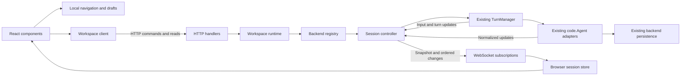

**Session and workspace state: review and proposed architecture**

Reviewed against commit `3b3b89d`, 7 September 2026. The session/runtime and web protocol refactor is now implemented; see [the implemented protocol](session-state-protocol.md) for its concrete contract, validation, and limits. The findings and source line references below describe the reviewed pre-refactor state. The legacy project-directory collision remains a separate storage migration.

The central change should be to make the server publish a complete, versioned session view, give every session an explicit backend identity, and make browser navigation local. Keep the existing Go agent implementations, turn scheduler, React Query, and WebSocket transport. Change their responsibilities and contract.

The complexity is mostly caused by incomplete snapshots and implicit ownership. Moving the existing WebSocket hook into several smaller hooks would leave those problems intact.

**What exists today**

| Layer | Current responsibilities | Consequence |
| --- | --- | --- |
| Native `App` | Mounts one workspace `Server`; opening another folder replaces it | The same origin can refer to different workspace lifetimes |
| `code.Workspace` | Filesystem root, project state paths, MCP, language services, tools | A useful resource boundary, but opened-folder identity and project persistence identity differ |
| `code.Agent` | Multiple backend sessions, history, usage, model/mode settings, execution | Already a useful provider boundary |
| `TurnManager` | One running turn per session, FIFO follow-ups, steering, cancellation, optional queue persistence | Useful execution semantics shared with the TUI |
| HTTP/WebSocket server | A mutable active agent plus separate maps for phase, input metadata, usage, prompts, and task pumps | Reconstructs state from several independently changing owners |
| `useWebSocket` | Connection lifecycle, history conversion, live transcript assembly, snapshot reconciliation, pending inputs, prompts, errors, event bus | 1,149 lines; transport and application state are inseparable |
| React Query | Catalogs, session list, model/mode settings, workspace resources | Invalidation events are part of the correctness contract |
| `App.tsx` | Tabs, pane selection, active session, URL handling, session creation/loading, backend switching, documents and debugging | 3,808 lines; effects reconcile multiple representations of navigation |

The current send path is HTTP session creation, a WebSocket queue frame, an HTTP response containing only the ID, then a WebSocket send command. Loading is an HTTP mutation whose actual result arrives over an unrelated broadcast WebSocket. Reconnect sends a list of IDs and asks the server to reconstruct each session from whatever happens to be resident in memory.

Source: [server ownership](../server/server.go#L56), [WebSocket commands](../server/handler_chat.go#L18), [session loading](../server/server.go#L704), [browser session loading](../server/ui/src/App.tsx#L1632), [workspace mounting](../app/main.go#L156).

**Review findings, in priority order**

1. **High: restored queued work loses its identity and editable content in the web protocol.** `TurnManager` restores complete inputs from `TurnQueueStore`, but `TurnInputSnapshot` drops their content. `sendTurnSnapshot` then reconstructs each wire entry from `Server.turnMeta`, which is an empty memory-only map after restart. The resulting entry has an empty ID, intent, text, and attachments. Editing also requires an entry in that map. Background task notifications submit directly to `TurnManager`, bypassing this map too; their origin should be represented explicitly rather than producing an empty user input.

   A temporary test that restored an input with ID `saved-input` and text `fix the tests` produced `{ID: State:queued Intent: Position:1 Text: Files:[] Images:[]}`. This is a reproduced defect in the server projection, independent of browser rendering.

   Source: [queue restoration](../pkg/code/turns.go#L72), [snapshot shape](../pkg/code/turn_types.go#L81), [wire reconstruction](../server/handler_chat.go#L349), [queue editing](../server/handler_chat.go#L304), [task result submission](../server/handler_tasks.go#L117).

2. **High: reconnect cannot reconstruct the state a connected client was seeing.** `sendSessionState` reads committed backend messages, usage, phase, pending prompts, and the queue separately. It does not retain or include unfinished assistant text. The browser preserves some previous live entries and guesses whether committed history represents them, using provider IDs or matching content. A client that missed part of an unfinished response cannot recover that missing part from this snapshot. Turn completion sends usage/list/phase notifications, without an authoritative final transcript replacement.

   A temporary probe streamed `unfinished prefix`, then requested a snapshot before the backend committed it. The snapshot contained only the user message. Separately, an unloaded session ID produced an apparently successful empty `session_state`: reconnect never calls `LoadSession`. After a process restart, a browser can therefore receive an empty view of saved history instead of loading it.

   Source: [snapshot assembly](../server/server.go#L645), [reconnect command](../server/handler_chat.go#L99), [browser reconciliation](../server/ui/src/hooks/useWebSocket.ts#L280), [browser reconnect](../server/ui/src/hooks/useWebSocket.ts#L1069), [turn finalization](../server/handler_chat.go#L267).

3. **High: changing the selected backend changes execution ownership for every client.** `POST /api/agent` swaps the workspace's sole agent and turn manager, cancels the previous manager, closes its agent, and resets server maps. Events carry only a session ID. An asynchronous operation started against the old agent can subsequently call helpers that read the new active agent. Session caches also omit backend identity. Following a deep link to another backend performs this global mutation.

   Every browser receiving `agent_changed` clears its chat state and normally creates a new session. A navigation event thus has execution and session-creation side effects across connected browsers. These consequences follow directly from the handlers; this review did not run a full concurrent-browser reproduction.

   Source: [agent switch](../server/handler_agent.go#L54), [runtime replacement](../server/server.go#L302), [browser switch/deep-link effects](../server/ui/src/App.tsx#L1677), [unscoped query keys](../server/ui/src/api/query.ts#L4).

4. **High: project persistence keys can collide.** `projectKey` replaces path separators with underscores and lowercases the result. Distinct paths such as `/parent/a_b/c` and `/parent/a/b_c` produce the same key. That key selects the directory for sessions, memory, and other project state. Lowercasing also merges distinct paths on a case-sensitive filesystem. This is separate from the UI protocol problem and needs a deliberate storage migration.

   A temporary probe confirmed that these two path shapes produce the same key. It exercised the key function directly; it did not modify any existing saved state.

   Source: [project key and state directory](../pkg/code/workspace.go#L1481).

5. **Medium: receiving any session event is treated as having loaded its history.** All frames, including sync responses, go to every connected client. `updateSession` creates an empty session on demand, and `hasSession` checks only map membership. A browser that receives a phase or queue event for a session can subsequently skip `loadSession` when the user opens it, even though it has never received its history. One client's load/sync also forces snapshot reconciliation in other clients.

   Source: [broadcast fan-out](../server/server.go#L625), [existence check and implicit creation](../server/ui/src/hooks/useWebSocket.ts#L333), [load shortcut](../server/ui/src/App.tsx#L1642).

6. **Medium: several changes have no reliable way to replace stale client state.** A session snapshot preserves the old browser prompt and error; it replays currently pending prompts without explicitly clearing prompts resolved while that browser was disconnected. The server supports multiple pending prompts but the browser stores one per session. Mode and effort mutations do not broadcast corresponding changes, despite indefinitely fresh query caches. ACP configuration, mode, title, and usage updates are absorbed by the adapter without notifying the web state layer. Session deletion broadcasts a list invalidation without identifying the deleted session to other clients' open tabs.

   Source: [snapshot reducer](../server/ui/src/hooks/useWebSocket.ts#L536), [prompt map](../server/handler_prompt.go#L65), [mode mutation](../server/handler_mode.go#L37), [effort mutation](../server/server.go#L860), [ACP state updates](../pkg/code/acp/agent.go#L1092), [deletion](../server/server.go#L772).

7. **Medium: delivery status and execution identity are conflated.** WebSocket `send()` confirms only that the browser accepted a write. Disconnect changes unacknowledged inputs to failed, even if the server accepted and completed them. A subsequent send generates another UUID. `TurnManager` rejects duplicate IDs only while they are live and releases them on completion. Its comment that submission is accepted exactly once does not describe reconnect/retry semantics across completed inputs or process restarts.

   Source: [browser send](../server/ui/src/hooks/useWebSocket.ts#L909), [disconnect](../server/ui/src/hooks/useWebSocket.ts#L1085), [live duplicate detection](../pkg/code/turns.go#L146), [completed ID removal](../pkg/code/turns.go#L287).

8. **Medium: workspace replacement relies on the initiating page reloading.** Native mounting replaces `App.server` and asynchronously closes the previous server. The initiating browser navigates to `/`, but `Server.Close` does not explicitly close its chat WebSockets. Those handlers use the HTTP request context rather than the server lifetime. Other connections and delayed requests need an explicit workspace lifetime boundary, particularly because the origin remains unchanged.

   Source: [native replacement](../app/main.go#L185), [page reload](../server/ui/src/App.tsx#L1232), [server cleanup](../server/server.go#L261), [socket read loop](../server/handler_chat.go#L18).

**The target ownership model**

Keep one opened workspace per native window/server. Within it, create backend runtimes lazily and address sessions explicitly. Selecting a backend in the UI chooses which sessions to browse and which backend to use for a draft. Each created session keeps its backend for its lifetime. Existing running sessions continue when the selection changes.



| State | Owner | Browser representation |
| --- | --- | --- |
| Opened root and workspace lifetime | Workspace runtime | Immutable connection scope |
| Backend process and backend sessions | Backend registry / `code.Agent` | Explicit backend ID in session references |
| Execution and follow-up queue | Existing `TurnManager` | Read-only projection in the session view |
| Durable conversation and recovery | Existing backend persistence | Rendered transcript from the session view |
| Visible transcript, live output, current activity, pending prompts | Session controller | One versioned session store |
| Session settings | Backend session, normalized through controller | Included in that session view |
| Session/catalog lists and workspace reads | HTTP resource APIs | React Query |
| Open tabs, pane focus, selected backend, drafts, editor buffers | Browser | Local state, separate from server state |

The session controller is a materialized view and a command boundary. It does not become another turn scheduler or independently infer which inputs are queued. It incorporates authoritative changes from the existing owners. Replace the server's global parallel maps with session-owned fields; do not keep both implementations synchronized indefinitely.

These are logical owners, not new services. Small structs in `server/runtime.go` and `server/session.go`, a transport implementation in `server/events.go`, and a normalized update contract alongside the existing `pkg/code` interfaces are sufficient. Avoid introducing a package hierarchy just to represent the diagram.

Bind callbacks, prompts, task results, and progress sinks to their owning backend/session at creation. They should never look up a mutable `activeAgent` to find their destination. Missing session context must result in an explicit unresolved workspace-level request or an error. The existing last-active/any-session prompt fallbacks are unsuitable when several sessions run concurrently.

Shared MCP callbacks also need a workspace owner: the built-in agent constructor currently installs its own elicitation callback on `ws.MCP`. Route requests with session correlation to that exact controller, and keep uncorrelated requests at workspace scope. Backend construction must not replace another owner's callback on shared services. [Current MCP binding](../pkg/code/agent/agent.go#L157).

Backend runtimes should share the workspace's filesystem/language services. They can remain resident initially. Later unloading must require no subscribers, active turns, background tasks, pending prompts, or scheduled work that needs that runtime. Closing a chat tab only unsubscribes the view.

**Identity and lifetime**

Use these distinct concepts:

```ts
type SessionRef = {
  workspaceId: string;
  backendId: string;
  sessionId: string; // Native backend ID, treated as opaque.
};

type WorkspaceScope = {
  workspaceId: string; // Stable identity of the opened root.
  instanceId: string;  // New for each workspace-server lifetime.
};

type ViewVersion = {
  epoch: string;       // New when a session view is rebuilt/reopened.
  revision: number;    // Increases for each published change within that epoch.
};
```

Workspace instance identity prevents an old request from operating on a replacement workspace. Session view epochs prevent old deltas and retries from being applied after a backend/session reload. These versions are synchronization identifiers, not timestamps or durable journal sequence numbers.

A bootstrap endpoint returns the scope, protocol version, workspace capabilities, and available backend descriptors. Capabilities such as filesystem/debug support belong to the workspace; steering, deletion, modes, and model options belong to the backend/session. Do not let selecting a backend change unrelated workspace capabilities.

Every workspace request uses the bound instance ID, checked by the server before dispatch. Every existing-session command also supplies its expected view epoch. Every session event carries its full reference and version. An old instance/epoch produces a typed conflict requiring refresh; it cannot silently target a replacement runtime. Capture the actual runtime handle once per accepted operation and retain it until that operation settles.

Keep opened-folder identity separate from the existing project history lookup policy: today, subdirectories of one repository can share project storage. Use a hash or opaque ID backed by recorded canonical paths for new persistent identity, preserving filesystem case rules. Do not reuse `projectKey` as a unique ID. Preserve the old storage reader behind an explicit migration boundary; validate recorded ownership before moving data and report ambiguity instead of silently merging directories. Historical files without an origin cannot prove which colliding path owned them. Protocol adoption must not silently relocate saved sessions.

**A session snapshot must be sufficient on its own**

```ts
type SessionView = {
  ref: SessionRef;
  version: ViewVersion;
  title: string;
  load: "loading" | "ready" | "error";
  activity: "idle" | "running" | "waiting_for_input";
  entries: TranscriptEntry[];
  activeInputs: InputView[];
  queuedInputs: InputView[];
  queuePaused: boolean;
  prompts: PendingPrompt[];
  settings: SessionSettings;
  capabilities: SessionCapabilities;
  usage: Usage;
  error: SessionError | null;
};
```

The domain input envelope includes its ID, requested/effective intent, original visible text/attachments, execution content, and origin (`user`, `task`, or `schedule`). Persist this envelope with queued work and expose it from `TurnManager`; remove `turnMeta`. The wire `InputView` excludes execution-only content and carries only permitted display metadata. Hidden skill instructions and internal notifications must stay hidden, and non-user origins must not generate blank user transcript entries. Keep local `sending`/`unknown` delivery status in the browser outbox, separate from accepted queue state.

Capture a complete queue payload during each queue mutation and enqueue its notification in that mutation order. Dispatch outside the queue lock. Reconstructing a payload later from independent server maps or a fresh unordered read recreates the current problem. Likewise, the controller must release its projection lock before invoking backend/turn-manager operations that can synchronously call back.

The controller retains the live transcript while the backend runs, including periods with no connected browser. A snapshot includes that live tail and explicit empty prompt/queue arrays. An empty snapshot for a missing session is invalid: opening the subscription must ensure the backend session is loaded, or return a typed load/not-found/unsupported error. If ACP history loads progressively, publish a loading view and updates; transition to ready only on successful completion. Concurrent opens share one load operation.

Use stable entry IDs within a view epoch. Preserve input IDs and backend tool/text identifiers when available. The backend normalization layer must connect streamed and committed entries explicitly. For providers without item IDs, allocate them at stream boundaries and preserve the association through completion. Existing history can receive deterministic IDs during replay; rebuilding that association starts a new view epoch. Repeated identical prompts or answers must remain distinct entries.

This requires adapter work, not just a server wrapper: the present `iter.Seq2[Message, error]` plus reset/commit callbacks does not expose every configuration change or a complete committed-item identity. Introduce a narrow typed update contract for the application layer, with entry identity, input identity, attempt boundaries, committed replacements, and settings updates. Keep provider-specific message formats inside their adapters. The TUI can continue through the existing interface during migration and adopt the same normalized updates later.

Keep ACP and native-provider protocols behind the Go adapter boundary. The browser consumes Wingman's visible session model, including its queue and workspace lifecycle. Likewise, project durable runtime events into that visible model before transmission: raw ledger/context events can contain hidden execution content and are not the public UI contract.

Retry cleanup belongs in this normalization/controller layer. Remove entries from the failed attempt by identity, retain committed tools/results, and publish explicit replacements/removals. React should not maintain `liveEntryIds` and `attemptEntryIds`, or match history by equal text. Keep provider context compaction separate from the user-visible transcript; the built-in ledger already distinguishes canonical messages from context checkpoints.

**Communication: HTTP operations plus one subscribed WebSocket**

Use ordinary HTTP for commands with typed outcomes. Keep one WebSocket for ordered session updates and workspace invalidations. Its client messages are subscription control, not a second implementation of application commands. Keep terminal byte streams on their existing dedicated sockets.

This choice fits the existing application: its resource APIs already use HTTP and its real-time transport already uses WebSocket. A single WebSocket RPC protocol would require request correlation, timeouts, cancellation, and retry handling for all those resource operations. HTTP plus server-sent events is also viable, but changing the transport does not fix ownership or snapshot consistency. Prefer the smaller change that establishes those contracts first.

Representative routes under `/api/v2`:

| Operation | Route / response |
| --- | --- |
| Bootstrap | `GET /bootstrap` → scope, protocol, capabilities, backends |
| Browse sessions | `GET /backends/:backend/sessions` → summaries, including activity |
| Create session | `POST /backends/:backend/sessions` → session reference, view epoch, and receipt; accepts draft settings |
| Submit input | `POST /backends/:backend/sessions/:session/inputs` → accepted receipt |
| Edit/remove queued input | `PATCH` / `DELETE .../inputs/:input` → receipt or typed conflict |
| Cancel current turn | `POST .../cancel` with explicit queue policy → receipt |
| Resume/clear queue | `POST .../queue/resume` / `POST .../queue/clear` → receipt |
| Resolve prompt | `POST .../prompts/:prompt/response` → accepted/already-resolved/expired outcome |
| Change settings | `PATCH .../settings` → receipt; authoritative settings arrive on the stream |
| Delete session | `DELETE .../sessions/:session` → deleted/deleting/unsupported outcome |
| Observe session | WebSocket subscribe with `SessionRef` → complete snapshot, then changes |

The workspace instance header scopes these HTTP routes; the backend and session path components scope the resource. The browser WebSocket opens `/api/v2/events?instance=<instanceId>` and the server validates/binds that instance at upgrade, since the browser WebSocket API does not allow arbitrary request headers. [WebSocket interface](https://websockets.spec.whatwg.org/#the-websocket-interface). Keep existing file/Git/editor endpoints and their HTTP semantics, adding the workspace lifetime check centrally.

An accepted command does not mean a turn has completed. Its receipt contains the request/input ID, owner, and relevant epoch. The browser uses that receipt only for outbox delivery state. It never patches the transcript from an HTTP command response. Authoritative session state arrives through the ordered subscription, avoiding races between independent HTTP and WebSocket state writes.

Use a small discriminated event union, for example:

```ts
type SessionChange =
  | { type: "entry.upsert"; entry: TranscriptEntry }
  | { type: "entry.append"; id: string; text: string }
  | { type: "entries.remove"; ids: string[] }
  | { type: "state.replace"; state: SessionStateFields };

type SessionUpdate = {
  type: "session.update";
  subscriptionId: string;
  ref: SessionRef;
  epoch: string;
  previousRevision: number;
  revision: number;
  changes: SessionChange[];
};
```

`SessionStateFields` contains the complete non-transcript portion of the view, including explicit empty collections and nullable errors. Apply each change batch atomically. Append events serve text/reasoning entries; use upserts for full replacements and structured tool entries. New entries append on first occurrence; replacements retain their position. Larger history replacements use a new snapshot. Snapshot/update/error responses echo the subscription ID, and session deletion is a separate identified control message. Validate envelopes at the boundary and use shared fixtures or generated DTOs to keep Go and TypeScript aligned; avoid another giant optional-field frame type.

Coalesce text append fragments before assigning/publishing a batch revision, then notify React at most once per animation frame. Never send full history on each token or assign invisible per-token revisions that appear as gaps after coalescing. Keep the existing bounded socket outbox behavior: close a slow connection and recover by snapshot instead of dropping arbitrary deltas.

Before taking a snapshot or publishing a structural change, flush pending fragments through the same reducer/revision boundary. A snapshot must never include unversioned buffered text that a later append would duplicate. Metadata replacement is a low-frequency operation; if large queues make it costly, split queue/settings/usage into typed replacement messages rather than sending attachment bytes repeatedly.

**The synchronization rule that removes the reconciliation code**

Start with snapshot-on-subscribe and snapshot-on-reconnect. There is no event replay log in the first version.

```mermaid
sequenceDiagram
    participant UI as Browser
    participant Hub as Subscription hub
    participant Session as Session controller
    UI->>Hub: Subscribe(ref, subscriptionId)
    Hub->>Session: Ensure loaded; attach subscription
    Note over Session: Serialize snapshot capture and subscription registration
    Session-->>UI: Snapshot(epoch E, revision R)
    Session-->>UI: Update(E, previous R, revision R+1)
    Note over UI: Connection interrupted
    UI->>Hub: Reconnect; subscribe with new subscriptionId
    Session-->>UI: Complete snapshot(E, revision N), including live output
    Session-->>UI: Update(E, previous N, revision N+1)
```

All writes to the view and publication of its updates use one per-session ordering mechanism. While attaching a subscription, capture an immutable snapshot and enqueue it to that client's outbox before making that subscription eligible for subsequent updates, under the same ordering mechanism. Backend loads/network calls happen outside this critical section. Locking `send()` alone is insufficient because it orders serialized frames without ordering the state they describe.

The browser accepts snapshots only for its current connection/subscription generation. A snapshot replaces the complete server-owned view. An update applies only when its epoch matches and `previousRevision` equals the stored revision. Ignore duplicates; a gap triggers resubscription. During resynchronization, discard stale-generation messages and wait for the new snapshot rather than attempting speculative merges. No cross-session ordering is required.

Subscribe full views for open chat tabs, including temporarily hidden tabs that retain a composer. Unsubscribe when they close. Use lightweight session summaries for the sidebar and running badges; a summary must never mark a full view as loaded. Workspace file/catalog events invalidate the matching React Query resource. On reconnect, refresh those resource queries once independently of session snapshot recovery.

Snapshot-first keeps recovery testable. A bounded replay optimization can be added only if measured snapshot costs justify it; it must retain the same snapshot fallback.

**Command retry semantics must be explicit**

Generate an input/request ID once and retain it while delivery is unresolved. Maintain an idempotency receipt map in the owning session controller for its view lifetime, including completed inputs. Repeating the same ID and payload returns the same receipt; reusing the ID with different content is a conflict. Check/reserve the receipt before scheduling work and settle concurrent callers through that same record.

Session creation uses a workspace-lifetime receipt keyed by the draft's creation request ID, since no session exists yet. Keep receipts until their owning lifetime ends; if a view is evicted/rebuilt, rotate its epoch and reject retries addressed to the old one. Publishing an epoch change while clients are attached requires an explicit replacement snapshot. Do not discard completed receipts silently while continuing to accept retries in the same epoch.

If the connection drops after acceptance, retrying within the same workspace instance and session epoch cannot execute the input again. If the receipt is lost, the UI displays delivery as unknown while resolving that ID. A prompt reply similarly targets an explicit session and prompt ID; resolving it in one browser removes it from every subscribed view.

Do not claim durable exactly-once execution. After a process restart or a rebuilt session epoch, automatic mutation retries are rejected. Restore committed history and the existing paused queue, reconcile interrupted work, and surface unresolved delivery to the user. Durable cross-restart input receipts would require an additional integration with the existing persistence boundary and atomic acceptance semantics; they are not a prerequisite for this first refactor. Never resume an uncertain mutating operation just to repair the UI.

**Frontend structure**

Create a workspace-scoped client/context that owns the connection, session store, React Query client, and command methods. Mount the workspace UI with the server instance as its lifetime key. On replacement, dispose subscriptions and requests before mounting the next instance; delayed results belong to the disposed client. Explicit instance checks on the server are still required because aborting a browser request cannot undo an already accepted operation.

Suggested responsibilities:

```text
server/ui/src/state/workspaceClient.ts  bootstrap, lifetime, commands
server/ui/src/state/sessionStore.ts     snapshots, revisions, subscriptions
server/ui/src/state/sessionReducer.ts   pure typed update application
server/ui/src/state/layoutReducer.ts    tabs, panes, chat context, navigation
server/ui/src/hooks/useSession.ts       subscribe/select a single session
server/ui/src/api/query.ts              scoped resource keys and invalidation
```

Use `useSyncExternalStore` for the session store's React integration, with stable immutable snapshots and subscriptions per session. Keep React Query for resource reads rather than also caching the same live `SessionView`. This follows React's external-store API and its guidance to avoid duplicate/contradictory state. [React state structure](https://react.dev/learn/choosing-the-state-structure), [external-store subscriptions](https://react.dev/reference/react/useSyncExternalStore).

Queries that vary by backend or session must include those IDs in their keys. The workspace-scoped QueryClient prevents data from one mounted workspace leaking into another. Keep path/debug version parameters where already needed. Query keys should describe all inputs to the resource read. [TanStack Query keys](https://tanstack.com/query/latest/docs/framework/react/guides/query-keys).

Represent view readiness explicitly as unsubscribed/loading/ready/error. Remove `hasSession` as a loading decision, HTTP-load promise maps, fabricated reconnect events, and mutation effects that create sessions in response to broadcasts. `App.tsx` composes controllers and views; it should not be the command/reconnection coordinator.

A draft is a local object with a stable tab ID, selected backend, composer content, attachments, and initial settings. Allocate a backend session once on first send or explicit creation, using a shared in-flight creation promise/idempotency key per draft. Adopt the returned reference without replacing the tab's React key. A rejected send retains the draft/input. Selecting a model or mode in a draft does not need to create a server session.

Use one layout reducer for tabs and focus. Keep one active tab per pane plus the focused pane; derive the focused tab. Track the last chat context explicitly for file/task actions, and update it in the same reducer transaction as navigation. Avoid storing an additional independently synchronized active session. Parse routes in one navigation controller; following a session URL selects its backend locally. Preserve existing deep-link URLs through a parser adapter during migration. If pane layout or drafts are persisted later, namespace them by workspace and validate references on restore.

Session model/mode/effort updates affect that session. Treat defaults for future sessions as a separate preference. Currently built-in `SetModel` and `SetEffort` update both session overrides and agent defaults; callers should not depend on that implicit coupling in the new API.

**Lifecycle rules**

- Creating/opening a session has one owner and one load operation; adding a second observer does not create another session or restart execution.
- Closing a browser/tab detaches its observers; active turns and background work retain their server lifetime.
- Deletion checks backend support first, blocks new commands, cancels and settles active work, deletes through the backend, then publishes an identified deletion. If cancellation is still settling, return a deleting state. Late callbacks are rejected by the controller lifetime. Other clients remove the matching tab/view.
- Workspace replacement publishes/closes the old connection boundary and closes old sockets, task pumps, prompts, and runtime owners. The initiating browser can keep its current full reload behavior during migration.
- File/document revisions and unsaved editor buffers retain their existing ownership. Moving them into the session store would entangle unrelated state again.

**What to retain and what to retire**

| Retain | Retire after its replacement ships |
| --- | --- |
| `code.Agent` provider abstraction and adapters | Global `activeAgent`/`swapAgent` navigation model |
| `TurnManager` scheduling, steering fallback, queue pause rules | Server `turnMeta` and UI reconstruction of queue payloads |
| Built-in runtime journal and interrupted-operation recovery | Normal web-turn finalization type-asserting the built-in agent and calling compatibility `Save` |
| Existing queue persistence, extended to preserve the input envelope | Duplicate phase/usage/prompt bookkeeping outside each controller |
| Legacy disk-format reader at the persistence boundary | Live-wire compatibility branches and content-based history matching |
| React Query resource caches and scoped invalidation | Backend/session state inferred from generic invalidation events |
| WebSocket writer queue, terminal sockets | Unsolicited full-session broadcasts and silent fire-and-forget commands |
| Existing editor buffer/conflict handling | Cross-workspace asynchronous work without a lifetime check |

The existing `pkg/session/legacy_migration.go` is already a clear compatibility boundary. Removing it would not simplify the browser's synchronization contract and could make old sessions unreadable. Keep it until there is an explicit supported-format retirement decision. Likewise, the built-in runtime ledger solves durability and context/history separation; it should not be replaced by a browser-oriented event log.

Before removing the `Save` backstop from normal server completion, verify that all built-in live writes and terminal outcomes cross the journal recorder successfully. Surface a persistence failure as a typed session error rather than merely suppressing a session-list invalidation.

**Migration in reviewable slices**

| Slice | Concrete change | Exit condition |
| --- | --- | --- |
| 1. Recovery contract | Add failing behavioral coverage for reconnect, queue restoration, scope changes and duplicate delivery. Add full queued-input snapshots and explicit input origin to `TurnManager`. | Restored queue IDs/content and hidden-origin behavior pass without `turnMeta` reconstruction |
| 2. Ownership | Introduce scoped workspace/backend/session controllers and normalized backend updates. Bind prompts, progress and task pumps to their owner. | Two backends and two sessions can run; selection/load never closes another runtime |
| 3. Protocol | Add bootstrap, typed HTTP commands, complete snapshots, atomic subscription attachment, per-session revisions and epoch checks. | Fresh attach/reconnect, in-flight load, unknown IDs, prompt resolution and stale commands pass at the server boundary |
| 4. UI cutover | Use the workspace client, session store and layout reducer; update session/model/mode pickers and navigation. | Existing workflows pass plus two-browser recovery tests; one authoritative update path per session |
| 5. Removal | Delete old send/sync/agent-switch handlers, monolithic reconciliation code, redundant maps and replaced API helpers. Rebuild bundled UI assets. | Searches show no v1 session callers; focused Go, UI and browser suites pass |

Use one temporary protocol-version cutover while the embedded UI and server are upgraded together. Both protocol handlers, if briefly needed, must call the same controller. Do not maintain dual state engines. Preserve public/TUI adapter compatibility where it is actually consumed, then migrate those consumers separately. No new state library, message broker, database, or generic event-sourcing framework is necessary.

Handle the project-key collision as a separate storage change with ownership metadata, migration tests, and ambiguity handling. It should not be hidden inside a frontend refactor.

**Behavioral verification required for the new design**

| Scenario | Required result |
| --- | --- |
| Fresh browser joins during text/reasoning/tool streaming | Full committed history plus the current live prefix exactly once |
| Reconnect before/after commit, or between retry reset and the next attempt | Same server view as a continuously connected browser; failed attempt entries disappear |
| Snapshot capture races with an update | Snapshot precedes subsequent revisions for that subscriber; no guessed merge |
| Snapshot/error arrives after unsubscribe, workspace replacement, or epoch change | Stale generation is ignored; old commands cannot reach the new owner |
| Server restarts with saved history and queued text/files/images | History loads; queue IDs/content survive and work stays paused |
| Another browser changes mode, resolves a prompt, or deletes the session | Every relevant subscribed view reflects the change |
| Two prompts are pending in one session | Both remain addressable until resolved/cancelled |
| Input completes before its HTTP acknowledgement reaches the browser | Same-ID retry returns the original receipt without another execution |
| Backend emits settings/title/usage updates outside a send | Session view and relevant summaries update |
| Repeated identical user input or answer | Distinct entry identities preserve both occurrences |
| Backend selection changes with an active turn or delayed history load | Running owner stays intact; late results cannot populate another backend |
| Hidden background-task input is queued/restored | Internal content remains hidden and is not displayed as a blank user message |
| Workspace is replaced with another client still connected | Old sockets close; client bootstraps the new scope |
| One client is slow; another is responsive | Slow client reconnects by snapshot; responsive client continues |
| Long transcript plus sustained streaming | Append traffic scales with new output; unrelated workspace/panel observers do not rerender on every token |

Use deterministic fake backends and real subscription handling for protocol tests, a pure reducer suite for duplicate/gap handling, and a small Playwright suite with two pages for lifecycle races. Continue the current built-in/ACP contract tests so the refactor preserves backend differences.

**Validation performed for this review**

- `node --test test/mainLayout.test.ts test/query.test.ts test/streamEntries.test.ts` in `server/ui`: 20 tests passed.
- `go test ./pkg/code ./pkg/code/agent ./pkg/session ./server -run 'Test(Turn|.*Queue|.*Session|AgentAPIContract|Confirm|Elicit|ConvertMessages|SnapshotHasActive)' -count=1`: all four packages passed.
- Three temporary Go overlay probes against the actual server projection reproduced the restored-queue, missing-live-text, and unloaded-session problems above. They use a minimal fake backend to control history/queue state; they are not browser end-to-end tests.
- A fourth temporary Go overlay probe reproduced the project-key collision for distinct path shapes. The probes intentionally assert the desired behavior and fail against the reviewed implementation. Overlay files remained outside the repository; no failing tests were added to the normal suite.
- Source review covered native workspace mounting, web APIs and hooks, built-in and ACP session lifecycles, queue persistence, runtime ledger/migration boundaries, task delivery, prompts, and the corresponding TUI interfaces. Full browser and live-provider suites were not run for this design-only pass.

The first implementation should prove complete snapshot recovery and explicit ownership before rearranging React components. Those contracts determine which synchronization code can actually be deleted.
